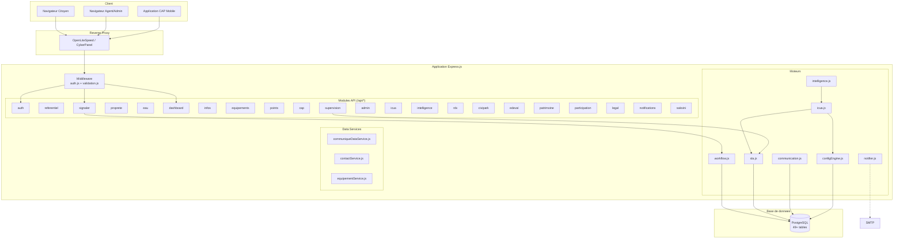
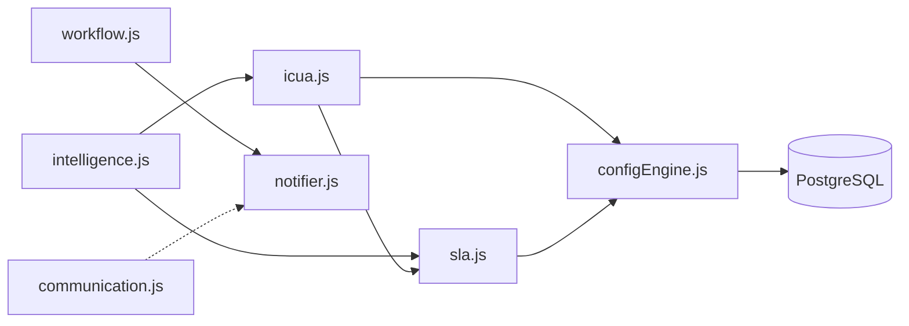
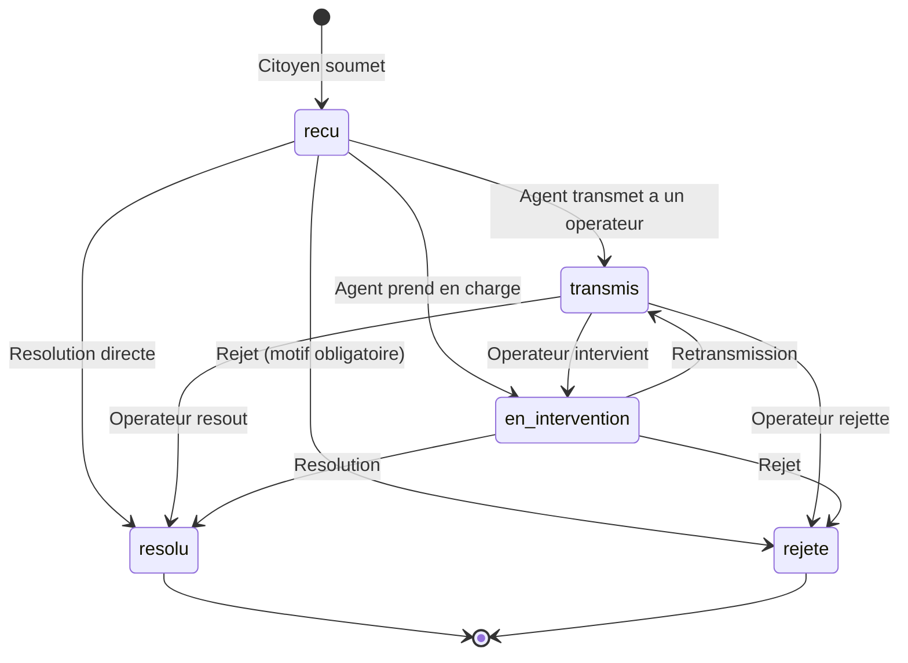
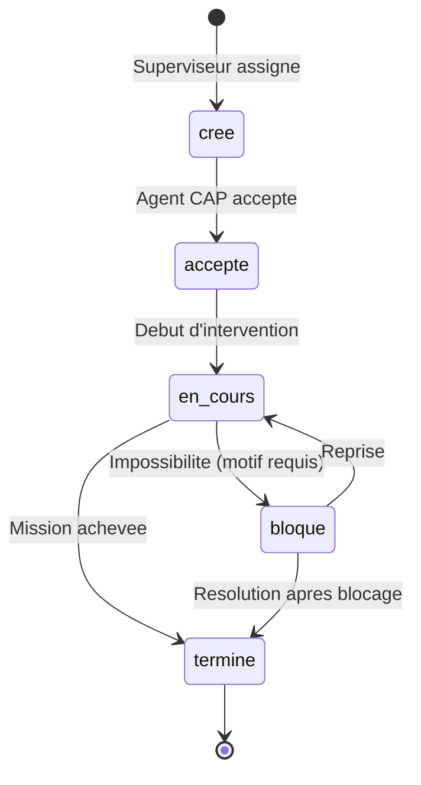
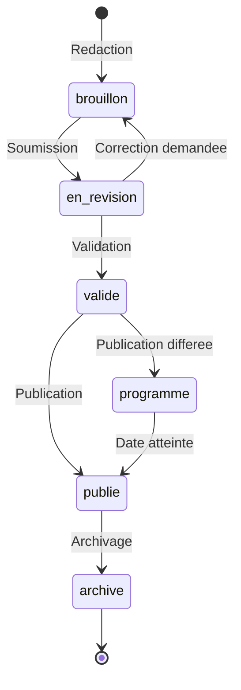
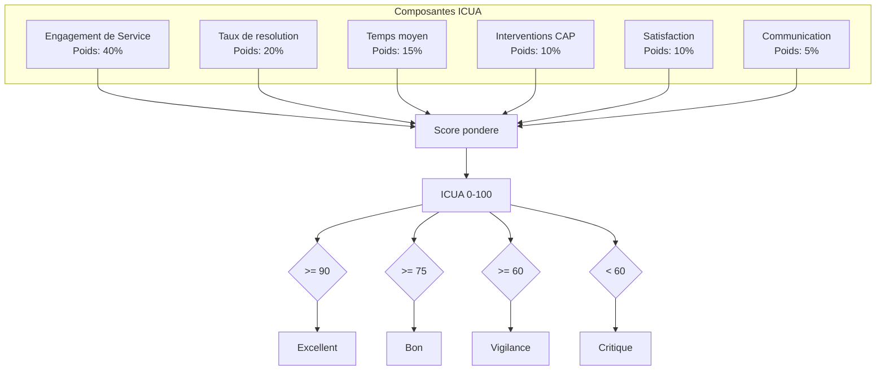

# ALGERNA -- Architecture de Reference

**Version** : v1.0.0-alpha.2
**Date** : 30 juin 2026
**Classification** : Document technique

---

## 1. Vue d'ensemble

ALGERNA est une application web monolithique structuree en modules, deployee derriere un reverse proxy CyberPanel/OpenLiteSpeed (OLS).

### Stack technique

| Couche | Technologie |
|--------|------------|
| Backend | Node.js + Express.js |
| Base de donnees | PostgreSQL |
| Frontend | Vanilla JavaScript SPA (Single Page Application) |
| Authentification | JWT (JSON Web Tokens) |
| Serveur web | CyberPanel / OpenLiteSpeed (reverse proxy) |
| Fichiers statiques | Servis par Express (`express.static`) |
| Email | Nodemailer (SMTP) |

### Principes architecturaux
- **Monolithe modulaire** : un seul processus Node.js, mais une organisation stricte en modules independants
- **API REST** : toutes les interactions frontend-backend passent par des endpoints JSON
- **SPA vanilla** : pas de framework frontend (React, Vue, Angular). L'interface est construite en JavaScript natif dans un fichier HTML unique
- **Double montage OLS** : les routes sont montees sur `/api/*` et sur `/*` pour gerer le contexte OLS qui peut supprimer le prefixe `/api`
- **Gateway proxy** : un endpoint `/api/gw` (POST) sert de passerelle pour les modules ajoutes apres le demarrage d'OLS

---

## 2. Architecture systeme



---

## 3. Front Office -- Portail citoyen

Le portail citoyen est l'interface principale destinee aux habitants de la Wilaya d'Alger. Il est accessible depuis un navigateur web (mobile ou desktop) sans installation.

### Pages et fonctionnalites

| Page | Description |
|------|-------------|
| **Dashboard** | Vue d'ensemble : derniers signalements du citoyen, statistiques personnelles, points et niveau, activite du quartier |
| **Signaler** | Formulaire de signalement : choix du domaine et de la categorie, description, geolocalisation sur carte, prise de photo, soumission |
| **Ma Houma** | Le quartier numerique : signalements a proximite, activite locale, statistiques de zone. « Houma » signifie « quartier » en dialecte algerois |
| **Infos** | Communiques institutionnels (urgents, importants, informatifs), contacts utiles des services municipaux |
| **Equipements** | Carte et liste des equipements publics : parcs, ecoles, centres de sante, parkings, marches, etc. Recherche par type et par nom |
| **Saksini** | Moteur de recherche intelligent des services publics. « Saksini » signifie « guide-moi » en arabe algerois. Recherche par mot-cle avec synonymes en francais et en arabe |

### Caracteristiques techniques
- SPA vanilla JavaScript dans `public/index.html`
- Navigation par hash (`#dashboard`, `#signaler`, `#mahouma`, etc.)
- Carte interactive avec OpenStreetMap (tuiles OSM)
- Interface bilingue francais/arabe (fichier `public/i18n.js`)
- Progressive Web App (PWA) avec `manifest.json` et `sw.js`
- Responsive : adaptation mobile et desktop

---

## 4. Back Office -- Interfaces d'administration

Le back office regroupe les outils de gestion destines aux agents, operateurs et administrateurs.

### 4.1 Kanban Agent
Tableau de bord des signalements en format kanban, organise par statut (recu, transmis, en intervention, resolu, rejete). Chaque agent voit les signalements de sa commune. Fonctionnalites : changement de statut par glisser-deposer, affectation, commentaires, consultation du detail via un drawer lateral.

### 4.2 Application CAP
Interface dediee aux Agents de Proximite. Liste des missions assignees, detail de chaque mission avec carte, changement de statut (cree, accepte, en_cours, termine, bloque), prise de photo, signalement d'alerte superviseur, creation de signalements terrain.

### 4.3 Centre de Supervision
Tableau de bord strategique pour admin_apc et admin_wilaya :
- KPI operationnels (signalements ouverts, resolus, temps moyen, taux de conformite, ICUA)
- Classement des communes par performance
- Classement des services/operateurs
- Filtrage par commune

### 4.4 Administration
Interface de gestion du referentiel systeme (admin_wilaya) :
- Configuration systeme (ConfigEngine)
- Gestion des utilisateurs
- Gestion des communes
- Gestion des operateurs (EPIC)
- Configuration des categories et delais SLA
- Gestion des equipements publics

### 4.5 Centre d'Intelligence Operationnelle
Interface decisionnelle (admin_apc, admin_wilaya) :
- Resume global (ICUA, sante, hors delai, vigilance)
- Facteurs de degradation
- Priorites d'action

---

## 5. Modules backend

L'application est organisee en 22 modules independants, chacun dans `src/modules/<nom>/index.js`. Chaque module exporte un routeur Express monte sur `/api/<nom>`.

| Module | Chemin API | Description |
|--------|-----------|-------------|
| `auth` | `/api/auth` | Authentification, inscription, connexion, gestion du profil, preferences utilisateur |
| `referentiel` | `/api/referentiel` | Donnees de reference : communes (57), wilayas, categories de signalement, operateurs |
| `rdv` | `/api/rdv` | Rendez-vous en ligne avec les services communaux |
| `proprete` | `/api/proprete` | Signalements du domaine proprete avec sous-categories specifiques |
| `eau` | `/api/eau` | Signalements lies a l'eau et a l'assainissement |
| `signaler` | `/api/signaler` | Moteur central de signalement : creation, suivi, transitions de statut, historique |
| `points` | `/api/points` | Systeme de gamification : points, niveaux, badges, bareme, avantages symboliques |
| `dashboard` | `/api/dashboard` | Statistiques du tableau de bord citoyen et agent |
| `infos` | `/api/infos` | Communiques institutionnels et contacts utiles |
| `equipements` | `/api/equipements` | Equipements publics : parcs, ecoles, centres de sante, parkings, marches |
| `cap` | `/api/cap` | Corps des Agents de Proximite : agents, missions, workflow terrain, alertes |
| `civipark` | `/api/civipark` | Stationnement urbain : zones, cartes resident, encaissements, extensions |
| `edeval` | `/api/edeval` | Evaluation du patrimoine public (IQEP), gestion du parc |
| `patrimoine` | `/api/patrimoine` | Inventaire du patrimoine immobilier et mobilier public |
| `participation` | `/api/participation` | Participation citoyenne : consultations, sondages |
| `legal` | `/api/legal` | Textes juridiques, cadre reglementaire |
| `notifications` | `/api/notifications` | Preferences de notification et historique |
| `saksini` | `/api/saksini` | Moteur de recherche intelligent des services publics (recherche multi-langue) |
| `supervision` | `/api/supervision` | Centre de Supervision : KPI, classements, tableaux de bord operationnels |
| `admin` | `/api/admin` | Administration systeme : config, utilisateurs, communes, operateurs, categories, equipements |
| `icua` | `/api/icua` | Indice Citoyen Urbain ALGERNA : calcul et exposition du score composite |
| `intelligence` | `/api/intelligence` | Intelligence Operationnelle : resume, facteurs, priorites |

---

## 6. Moteurs et services centraux

Les moteurs sont des services partages (`src/services/`) qui encapsulent la logique metier transversale. Ils sont utilises par les modules mais ne sont pas exposes directement via des routes.

### 6.1 Moteurs principaux

| Moteur | Fichier | Responsabilite |
|--------|---------|---------------|
| **Workflow** | `workflow.js` | Gestion des transitions de statut des signalements. Machine a etats avec validation des transitions autorisees, historique, notifications |
| **Communication** | `communication.js` | Workflow des communiques institutionnels. Machine a etats : brouillon, en_revision, valide, programme, publie, archive |
| **SLA** | `sla.js` | Calcul des delais et statuts d'Engagement de Service. Determine si un signalement est conforme, en echeance proche ou hors delai |
| **ICUA** | `icua.js` | Calcul du score composite ICUA (0-100). Integre les 6 composantes, avec ponderations configurables via ConfigEngine |
| **Intelligence** | `intelligence.js` | Analyses decisionnelles : resume global, facteurs de degradation, priorites. S'appuie sur ICUA, SLA, Workflow, CAP |
| **ConfigEngine** | `configEngine.js` | Configuration centralisee. Toutes les valeurs systeme (ponderations ICUA, delais SLA, seuils) sont stockees en base et mises en cache (5 min) |
| **Notifier** | `notifier.js` | Service de notification multi-canal. Email actif (SMTP/Nodemailer), SMS prepare pour phase 2. Fire-and-forget : ne bloque jamais le flux principal |

### 6.2 Data Services

| Service | Fichier | Responsabilite |
|---------|---------|---------------|
| **CommuniqueDataService** | `communiqueDataService.js` | Acces aux donnees des communiques institutionnels |
| **ContactService** | `contactService.js` | Acces aux donnees des contacts utiles |
| **EquipementService** | `equipementService.js` | Acces aux donnees des equipements publics |

### Dependances entre moteurs



---

## 7. Base de donnees

### 7.1 PostgreSQL

La base de donnees utilise PostgreSQL, accessible via le pool de connexions defini dans `src/db/pool.js`. Les migrations sont gerees par des fichiers SQL sequentiels dans `src/db/migrations/`.

### 7.2 Tables principales (49+)

Les tables sont creees par les migrations successives. Parmi les tables principales :

**Domaine citoyen** :
- `utilisateur` -- comptes utilisateurs (citoyens, agents, admins)
- `signalement` -- signalements citoyens (reference, domaine, categorie, etat, coordonnees, photos)
- `signalement_historique` -- historique des transitions de statut
- `signalement_confirmation` -- confirmations par d'autres citoyens
- `impact_message` -- messages de remerciement apres resolution

**Domaine gamification** :
- `bareme_points` -- regles d'attribution de points par action
- `badge` -- definitions des badges
- `utilisateur_badge` -- badges obtenus par les utilisateurs
- `niveau` -- definitions des niveaux de progression
- `avantage_symbolique` -- avantages lies aux niveaux

**Domaine referentiel** :
- `commune` -- 57 communes de la Wilaya d'Alger
- `categorie_signalement` -- categories et sous-categories
- `operateur` -- EPIC et services techniques
- `equipement_public` -- equipements publics georeferencies
- `contact_utile` -- contacts des services municipaux
- `communique` -- communiques institutionnels

**Domaine CAP** :
- `cap_agent` -- profils etendus des agents CAP (specialisation, commune, zone)
- `cap_intervention` / `mission_cap` -- missions terrain avec workflow
- `alerte_cap` -- alertes superviseur

**Domaine CiviPark** :
- `parking_zone` -- zones de stationnement
- `carte_resident` -- cartes de stationnement resident
- `parking_encaissement` -- encaissements horodateurs
- `parking_extension` -- extensions de duree

**Domaine EdeVal** :
- `parc` -- elements du parc public
- `iqep` -- evaluations IQEP (Indice de Qualite de l'Espace Public)

**Domaine systeme** :
- `config_systeme` -- parametres de configuration (ConfigEngine)

---

## 8. RBAC -- Controle d'acces base sur les roles

### 8.1 Roles

L'application definit 5 roles, organises hierarchiquement :

| Role | Description | Perimetre |
|------|-------------|-----------|
| `citoyen` | Habitant de la Wilaya | Ses propres signalements, son quartier, les informations publiques |
| `agent` | Agent municipal ou CAP | Signalements de sa commune, missions CAP |
| `operateur` | Agent d'un operateur (EPIC) | Signalements transmis a son operateur |
| `admin_apc` | Administrateur communal | Toutes les donnees de sa commune, supervision locale |
| `admin_wilaya` | Administrateur Wilaya | Toutes les donnees, configuration systeme, intelligence operationnelle |

### 8.2 Groupes de roles

Le middleware `auth.js` definit des groupes pre-configures pour simplifier le controle d'acces :

| Groupe | Roles inclus | Usage |
|--------|-------------|-------|
| `CITOYENS` | citoyen | Routes du portail citoyen |
| `AGENTS` | agent, operateur | Routes du back office agent |
| `CAPS` | agent | Routes specifiques CAP |
| `SUPERVISORS` | admin_apc, admin_wilaya | Supervision et pilotage |
| `ADMINS` | admin_wilaya | Administration systeme |
| `BACKOFFICE` | agent, operateur, admin_apc, admin_wilaya | Toutes les routes back office |
| `ALL_STAFF` | agent, operateur, admin_apc, admin_wilaya | Tout le personnel |

### 8.3 Mecanisme d'authentification
- Authentification par JWT (Bearer token)
- Le token contient : `id`, `role`, `commune_id`, `operateur_id`
- Middleware `authenticate` : verifie la validite du token
- Middleware `requireRole(...roles)` : restreint l'acces aux roles specifies
- Duree de validite configurable via `config.jwt.expiresIn`

---

## 9. Workflows

### 9.1 Workflow Signalement

Le workflow des signalements est gere par `workflow.js`. Chaque transition est validee, historisee et peut declencher des notifications.



**Etats** :
- `recu` : signalement enregistre, en attente de prise en charge
- `transmis` : transfere a un operateur ou service specifique
- `en_intervention` : intervention en cours sur le terrain
- `resolu` : probleme resolu, date de resolution enregistree
- `rejete` : signalement rejete avec motif obligatoire

### 9.2 Workflow CAP (Missions)

Le workflow des missions CAP est gere directement dans le module `cap`. Les transitions sont strictement lineaires avec une branche de blocage.



**Etats** :
- `cree` : mission assignee, en attente d'acceptation
- `accepte` : l'agent CAP a pris en charge la mission
- `en_cours` : intervention terrain en cours
- `termine` : mission achevee (date de fin enregistree)
- `bloque` : impossibilite d'intervenir (motif obligatoire, alerte superviseur automatique)

### 9.3 Workflow Communique

Le workflow des communiques institutionnels est gere par `communication.js`. Il garantit une chaine de validation avant publication.



**Etats** :
- `brouillon` : en cours de redaction
- `en_revision` : soumis pour validation
- `valide` : approuve, pret a publier
- `programme` : publication planifiee a une date future
- `publie` : visible par les citoyens
- `archive` : retire de l'affichage, conserve en historique

---

## 10. Calcul ICUA

Le score ICUA est calcule par le moteur `icua.js` selon la formule suivante :



**Formule** :
```
ICUA = (engagement * 0.40) + (resolution * 0.20) + (temps * 0.15)
     + (cap * 0.10) + (satisfaction * 0.10) + (communication * 0.05)
```

Chaque composante est un score de 0 a 100. Les ponderations sont lues depuis le ConfigEngine et peuvent etre ajustees sans modification du code.

Le cache ICUA est recharge toutes les 10 minutes pour eviter des calculs couteux a chaque requete.

---

## 11. Operations Design System

L'interface back office utilise un systeme de composants CSS prefixes `ops-` (Operations), concus pour les ecrans de supervision et de gestion operationnelle.

### Composants

| Composant | Classe CSS | Description |
|-----------|-----------|-------------|
| **KPI Card** | `ops-kpi` | Carte d'indicateur : valeur numerique + libelle. Variantes de couleur via `ops-danger`, `ops-warning`, `ops-success`, `ops-info`, `ops-purple` (bordure laterale coloree) |
| **Status Badge** | `ops-status` | Badge de statut inline. Variantes : `ops-status-recu`, `ops-status-transmis`, `ops-status-en_intervention`, `ops-status-resolu`, `ops-status-rejete`, `ops-status-cree`, `ops-status-accepte`, `ops-status-en_cours`, `ops-status-termine`, `ops-status-bloque` |
| **SLA Badge** | `ops-sla` | Indicateur de delai compact. Variantes : `ops-sla-ok` (conforme), `ops-sla-warn` (echeance proche), `ops-sla-breach` (hors delai) |
| **Timeline** | `ops-timeline` | Historique vertical avec points colores (`ops-dot-info`, `ops-dot-success`, `ops-dot-warning`, `ops-dot-danger`), dates et descriptions |
| **Drawer** | `ops-drawer` | Panneau lateral coulissant (500px, pleine hauteur mobile). Structure : header, body scrollable, footer avec actions. Overlay avec backdrop-filter |
| **Table** | `ops-table` | Tableau de donnees : en-tetes majuscules, lignes alternees au survol, bordures fines. Utilise dans Supervision, Admin, Intelligence |

### Variables CSS

Le Design System definit des variables semantiques :
- `--ops-surface`, `--ops-border` : surfaces et bordures
- `--ops-success`, `--ops-warning`, `--ops-danger`, `--ops-info`, `--ops-purple` : couleurs d'etat
- `--ops-success-bg`, `--ops-warning-bg`, `--ops-danger-bg`, `--ops-info-bg` : fonds legers associes
- `--ops-neutral`, `--ops-neutral-bg` : etats neutres
- `--ops-radius` : rayon de bordure standard

---

## 12. Infrastructure de deploiement

### Environnement
- **Serveur** : CyberPanel avec OpenLiteSpeed
- **Reverse proxy** : OLS proxy context (peut supprimer le prefixe `/api`)
- **Node.js** : processus unique, port configure via `config.env`
- **PostgreSQL** : base de donnees locale, pool de connexions (`src/db/pool.js`)
- **SMTP** : serveur mail configurable pour les notifications email
- **Stockage fichiers** : upload local (photos de signalements, missions CAP)

### Securite applicative
- Helmet.js (en-tetes HTTP securises)
- CORS configure
- Rate limiting (300 requetes / 15 min)
- Validation des entrees (middleware `validation.js`)
- En-tetes no-cache sur toutes les routes API
- JWT avec expiration configurable

---

*ALGERNA -- Plateforme citoyenne de la Wilaya d'Alger*
*Architecture de reference -- v1.0.0-alpha.2*
